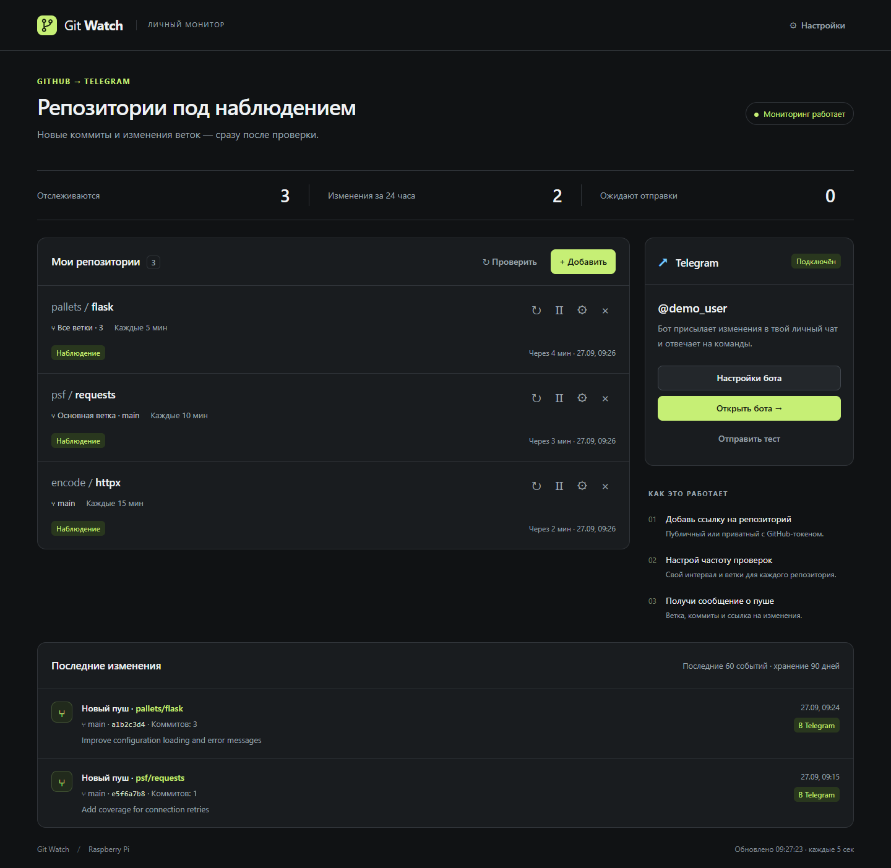
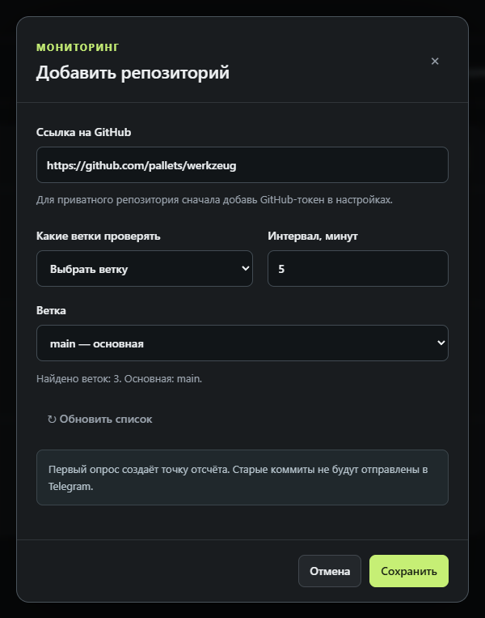
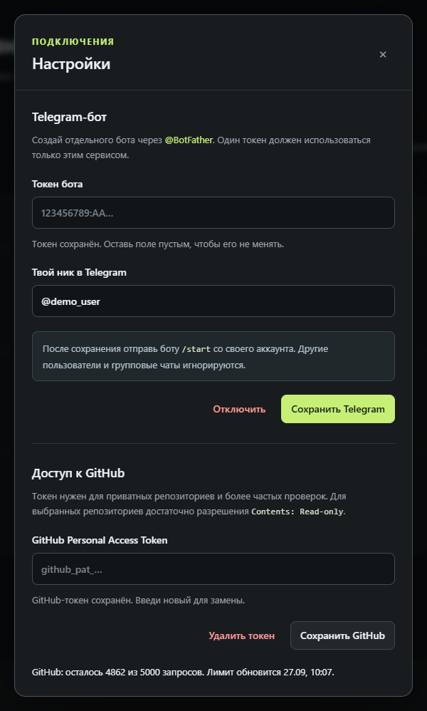
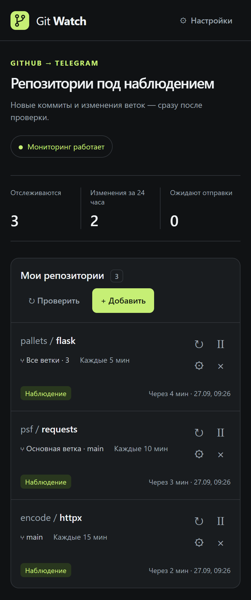

<div align="center">
  
  <h1>Git Watch</h1>
  <p>Изменения в GitHub — в вашем Telegram.</p>
  <p><strong>Python 3.11+ · локальная веб-панель · Raspberry Pi, Linux и Windows</strong></p>
  <p><a href="#быстрый-запуск">Быстрый запуск</a> · <a href="#скриншоты">Скриншоты</a> · <a href="README.md">English</a></p>
</div>

---

Следите за GitHub-репозиториями и получайте уведомления в Telegram об изменениях веток. Для каждого репозитория можно выбрать ветки и частоту проверок. Мониторинг продолжается и при закрытом браузере.



<p align="center"><sub>Настоящий интерфейс с демонстрационными данными. Сейчас приложение работает на русском языке.</sub></p>

## Возможности

| Возможность | Что даёт |
| --- | --- |
| Гибкий мониторинг | Публичные и приватные репозитории; все ветки, основная или выбранная ветка |
| Уведомления в Telegram | Описания коммитов, ссылки, повторная отправка при сбоях и добавление репозиториев через `/add` |
| Сохранение истории | SQLite, события за 90 дней и очередь, которая переживает перезапуск |
| Компьютер и телефон | Адаптивная панель, ручная проверка, пауза и необязательный прокси для Telegram |

## Быстрый запуск

Установите **Python 3.11+**, клонируйте репозиторий или скачайте **Code → Download ZIP**. Откройте терминал в папке проекта.

**Linux / macOS**

```bash
python3 -m venv .venv
.venv/bin/python -m pip install -r requirements.txt
.venv/bin/python run.py
```

<details>
<summary>Windows (PowerShell)</summary>

```powershell
py -3 -m venv .venv
.\.venv\Scripts\python.exe -m pip install -r requirements.txt
.\.venv\Scripts\python.exe run.py
```

</details>

Откройте **http://127.0.0.1:8788**. Оставьте процесс запущенным; для остановки нажмите `Ctrl+C`.

1. В **Настройках** укажите токен отдельного бота от [BotFather](https://t.me/BotFather) и свой ник в Telegram. Сохраните и отправьте боту `/start`.
2. Для приватных репозиториев или повышенного лимита запросов добавьте GitHub-токен. Для fine-grained token достаточно **Contents: Read-only** у выбранных репозиториев.
3. Нажмите **Добавить**, вставьте ссылку на репозиторий, выберите ветки и интервал. Первый опрос запомнит текущее состояние; уведомления придут о последующих изменениях.

## Скриншоты

| Выбор ветки и интервала | Подключение Telegram и GitHub |
| --- | --- |
| [](assets/screenshots/repository-setup.png) | [](assets/screenshots/settings.png) |

<details>
<summary>На телефоне</summary>
<p align="center"><a href="assets/screenshots/mobile.png"></a></p>
</details>

## Автозапуск на Raspberry Pi / Linux

На Debian / Ubuntu выполните из папки проекта:

```bash
sudo apt install -y python3 python3-venv git
sudo bash scripts/install.sh
```

Установщик создаст службу systemd с доступом через localhost. Для доверенной локальной сети передайте локальный IP устройства первым аргументом `install.sh`. Установленный Git-клон обновляется командой `bash scripts/update.sh`.

**У панели нет авторизации. Используйте localhost или доверенную локальную сеть; не открывайте панель напрямую в интернет.** Токены и настройки хранятся в исключённом из Git каталоге `data/`. Необязательный прокси для Telegram задаётся в `data/telegram-proxy.json` ключами `http` и `https`. Резервную копию можно создать командой `.venv/bin/python scripts/backup.py`; архивы из `backups/` содержат приватные данные.
